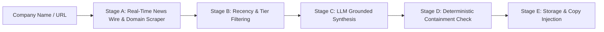

# Company Research & Grounded Personalization Pipeline

## 1. Pipeline Overview
To personalize job applications with real corporate context while maintaining 100% truthfulness, Maxume executes a **5-Stage Grounded Company Research Pipeline**.

---

## 2. Stage-by-Stage Architecture

### Stage A: Multi-Source Snippet Collection
1. **Google News RSS Wire**: Queries `https://news.google.com/rss/search?q={company}+launch+OR+funding+OR+news` for real-time, dated news articles from major press (*Reuters*, *TechCrunch*, *CNBC*, *VentureBeat*, *blog.google*).
2. **Direct Domain Scraping**: If a target company URL is provided, scrapes public about/news pages with polite headers and strict robots.txt compliance.

### Stage B: Recency & Source Tiering
* **Recency Filter**: Evaluates article publication dates against `PERSONALIZATION_RECENCY_DAYS` (default: 90 days).
* **Tier Prioritization**:
  * **Tier 1**: Official Company Domains (`about.company.com`, `blog.company.com`).
  * **Tier 2**: Major Verified Press (*Reuters*, *Bloomberg*, *CNBC*, *TechCrunch*, *Economic Times*).
  * **Tier 3**: Public Developer Portals (`github.com/company`).

### Stage C: Grounded Multi-LLM Synthesis
* Formats candidate snippets into strict input prompts:
  *"Summarize ONLY what is stated in these snippets into short, factual bullet points with source URLs in parentheses. Do not add outside knowledge. If nothing usable, say NO_SIGNALS_FOUND."*
* Dispatches to Groq (`llama-3.3-70b-versatile`) with automatic fallback to candidate headlines.

### Stage D: Deterministic Hallucination Containment Guard (ADR-005)
Before any signal enters a cover letter or database, it must pass `passes_containment_check(claim, source_snippets)`:
1. **Entity Extraction**: Verifies that every named entity and noun phrase in the claim is present in the source text.
2. **Metric & Numerical Verification**: Rejects any number, percentage, or currency figure that does not literally appear in the source text.
3. **Threshold Gate**: Requires a token containment score $\ge 0.65$.

### Stage E: Persistence & Personalization Injection
* Stored in SQLite `company_research_signals` with `guard_check_passed = 1`.
* Injected into the opening hook and closing paragraph of the generated Cover Letter and Application Email.
